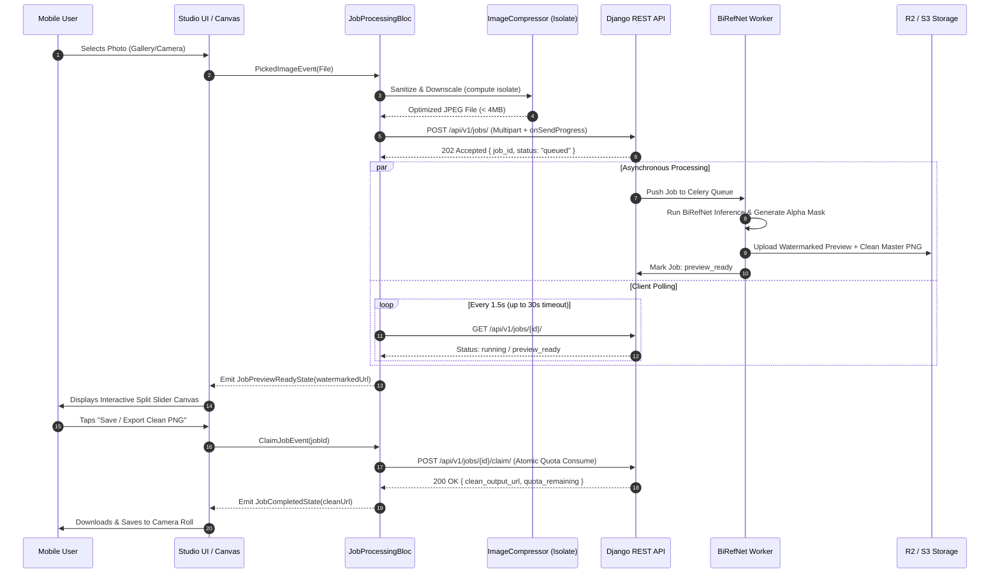

# 01. Architecture & Design Patterns

## 1. Architectural Philosophy: Feature-First Clean Architecture

The **RemoveIt** Flutter mobile app implements **Feature-First Clean Architecture**, combining Uncle Bob's Clean Architecture principles with Domain-Driven Design (DDD) sub-domains.

Rather than segregating the codebase by technical layers (e.g., placing all BLoCs in `/blocs` and all models in `/models`), the application is organized by **Business Feature** (e.g., `image_processing`, `studio_canvas`, `quota`, `monetization`, `history`, `authentication`). Each feature contains its own self-contained layers:

```
lib/
└── features/
    └── [feature_name]/
        ├── data/           # Outer layer: Data Transfer Objects (DTOs), Data Sources, Repositories
        ├── domain/         # Core layer: Pure Dart Entities, Repository Interfaces, Use Cases
        └── presentation/   # Outer layer: BLoC/Cubit, Screens, Feature-private Widgets
```

### The Inversion of Control Rule
Dependencies strictly point **inwards**:
- `presentation` depends on `domain` (via Use Cases).
- `data` depends on `domain` (implements Repository interfaces and maps to Entities).
- `domain` is pure Dart: **zero Flutter UI dependencies**, zero HTTP client dependencies, and zero database dependencies.

```
       +-------------------------------------------------------------+
       |                     Presentation Layer                      |
       |  (Flutter Widgets, StudioScaffold, Canvas, Blocs, Cubits)   |
       +------------------------------+------------------------------+
                                      |
                             depends on Use Cases
                                      v
       +-------------------------------------------------------------+
       |                        Domain Layer                         |
       |     (Pure Dart Entities, UseCases, Repository Contracts)    |
       +------------------------------+------------------------------+
                                      ^
                             implements Contracts
                                      |
       +-------------------------------------------------------------+
       |                         Data Layer                          |
       |  (Dio Remote Data Source, Drift SQLite, DTOs, Mappers)      |
       +-------------------------------------------------------------+
```

---

## 2. Layer Responsibilities & Boundaries

### 2.1 Domain Layer (`features/[feature]/domain/`)
The domain layer encapsulates enterprise business rules and entity structures. It represents the core truth of what RemoveIt operates on.

- **Entities**: Pure Dart objects representing core domain models (e.g., `JobEntity`, `UserQuotaEntity`, `HistoryItemEntity`, `AdConfigEntity`). They use immutable fields and value equality (`Equatable`).
- **Repository Interfaces**: Abstract contracts defining operations without leaking HTTP or SQL details (e.g., `abstract class JobRepository`).
- **Use Cases (Interactors)**: Single-responsibility classes executing a specific business action.

#### Mandatory Rule:
> **Never import `package:flutter/*`, `package:dio/*`, or `package:drift/*` inside the Domain layer.**

### 2.2 Data Layer (`features/[feature]/data/`)
The data layer coordinates data retrieval and mutations across external infrastructure.

- **Data Sources**:
  - `RemoteDataSource`: Interacts with the Django REST API via `ApiClient` (`Dio`).
  - `LocalDataSource`: Interacts with device storage (`Drift` SQLite database, `FlutterSecureStorage`, `SharedPreferences`).
- **Models (DTOs)**: Data Transfer Objects extending domain entities. They include `fromJson` and `toJson` methods and map raw JSON/SQLite columns to immutable Dart primitives.
- **Repository Implementations**: Implement domain repository contracts. They catch low-level `DioException` or `DatabaseException` and return functional `Either<Failure, T>` results.

### 2.3 Presentation Layer (`features/[feature]/presentation/`)
The presentation layer is responsible for the visual user experience and user interaction.

- **BLoC / Cubit**: Reactive state machines emitting immutable state objects in response to user events.
- **Screens**: Full-route page widgets (e.g., `HomeScreen`, `StudioCanvasScreen`, `HistoryScreen`, `PaywallScreen`) hosted within `StudioScaffold`.
- **Widgets**: Reusable visual components private to the feature (e.g., `ComparisonSplitSlider`, `BackdropPresetSelector`).

---

## 3. Functional Error Handling with `fpdart`

To avoid unhandled runtime exceptions and unpredictable `try/catch` cascades throughout the UI, all Domain use cases and Repository methods return an `Either<Failure, T>` from `fpdart`:

```dart
// lib/core/error/failures.dart
import 'package:equatable/equatable.dart';

abstract class Failure extends Equatable {
  final String message;
  final String? code;

  const Failure({required this.message, this.code});

  @override
  List<Object?> get props => [message, code];
}

class ServerFailure extends Failure {
  const ServerFailure({required super.message, super.code});
}

class QuotaExhaustedFailure extends Failure {
  const QuotaExhaustedFailure({
    super.message = "You have reached today's free removal limit.",
    super.code = "QUOTA_EXHAUSTED",
  });
}

class NetworkFailure extends Failure {
  const NetworkFailure({
    super.message = "No internet connection detected. Please check your network.",
    super.code = "NETWORK_UNAVAILABLE",
  });
}
```

### Clean Use Case Pattern
```dart
// lib/features/image_processing/domain/usecases/upload_image_usecase.dart
import 'dart:io';
import 'package:fpdart/fpdart.dart';
import 'package:removeit_app/core/error/failures.dart';
import 'package:removeit_app/features/image_processing/domain/entities/job_entity.dart';
import 'package:removeit_app/features/image_processing/domain/repositories/job_repository.dart';

class UploadImageParams {
  final File file;
  final Function(int sent, int total)? onProgress;

  UploadImageParams({required this.file, this.onProgress});
}

class UploadImageUseCase {
  final JobRepository repository;

  UploadImageUseCase(this.repository);

  Future<Either<Failure, JobEntity>> call(UploadImageParams params) async {
    return await repository.uploadImage(params.file, onProgress: params.onProgress);
  }
}
```

---

## 4. End-to-End Processing Architecture

The background removal workflow spans multiple distributed nodes (Mobile -> Django -> Celery -> BiRefNet Worker -> Storage):



---

## 5. UI Thread Offloading & Isolate Architecture

Image decoding, EXIF rotation parsing, and large bitmap downscaling can cause noticeable frame drops (jank) if executed on the main UI isolate.

RemoveIt strictly offloads all client-side image manipulations to Dart worker isolates via `compute()`:

```dart
// lib/core/utils/image_preprocessor.dart
import 'dart:io';
import 'package:flutter/foundation.dart';
import 'package:image/image.dart' as img;

class ImagePreprocessor {
  /// Offloads heavy image resizing and EXIF stripping to background isolate
  static Future<File> prepareForUpload(File originalFile, {int maxDimension = 2048}) async {
    return await compute(_processImageIsolate, _PreprocessInput(
      filePath: originalFile.path,
      maxDimension: maxDimension,
    ));
  }

  static File _processImageIsolate(_PreprocessInput input) {
    final bytes = File(input.filePath).readAsBytesSync();
    final decoded = img.decodeImage(bytes);
    if (decoded == null) throw Exception("Failed to decode image");

    // Auto-orient based on EXIF
    final oriented = img.bakeOrientation(decoded);

    // Downscale if larger than max dimension
    img.Image resized = oriented;
    if (oriented.width > input.maxDimension || oriented.height > input.maxDimension) {
      if (oriented.width >= oriented.height) {
        resized = img.copyResize(oriented, width: input.maxDimension);
      } else {
        resized = img.copyResize(oriented, height: input.maxDimension);
      }
    }

    // Save as compressed JPEG
    final outBytes = img.encodeJpg(resized, quality: 88);
    final tempPath = "${input.filePath}_optimized.jpg";
    final outFile = File(tempPath)..writeAsBytesSync(outBytes);
    return outFile;
  }
}

class _PreprocessInput {
  final String filePath;
  final int maxDimension;
  _PreprocessInput({required this.filePath, required this.maxDimension});
}
```

---

## 6. Architectural Decision Summary (ADR)

| Decision | Selection | Rationale |
| :--- | :--- | :--- |
| **Architecture** | Feature-First Clean Architecture | Strict layer boundaries, independent testability, modular team scaling. |
| **State Management** | Flutter BLoC / Cubit | Unidirectional data flow, reactive streams, auditable events, robust `bloc_test`. |
| **HTTP Client** | Dio with Interceptor Pipeline | Native multipart progress hooks, token refresh queue, exponential backoff. |
| **Local Database** | Drift (SQLite ORM) | Compile-time type-safety, relational schema for job history, fast reactive queries. |
| **Routing** | GoRouter | Declarative URL-based routes, stateful nested navigation, deep-linking support. |
| **Monetization** | Google AdMob + RevenueCat | AdMob SSV cryptographic security for free tier; RevenueCat cross-platform IAP for Pro. |
| **Code Modularity** | < 300 Lines Rule | Strict modular decomposition; screen files are thin orchestrators with zero monolithic widgets. |

