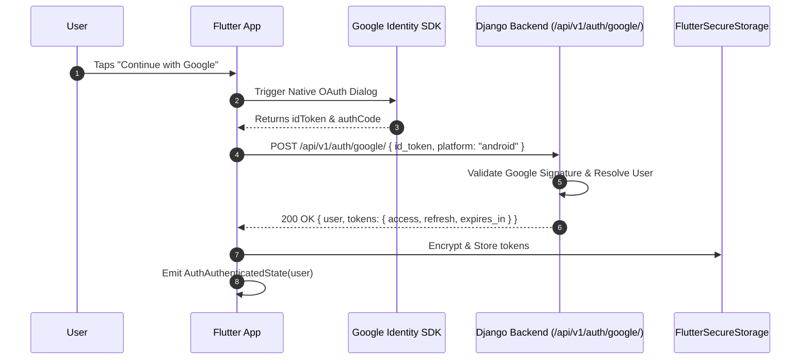

# 05. Authentication, Guest Mode & Mobile Security

## 1. The Frictionless Guest-First Philosophy

Consumer utility apps suffer up to a **70% drop-off rate** when forcing registration before allowing users to try the core value proposition.

RemoveIt adopts a strict **Guest-First Architecture**:
1. **Immediate Usage:** First-time users can launch the app, pick a photo, and preview AI background removal immediately without entering an email or password.
2. **Anonymous Identification:** A secure hardware-derived device UUID is generated on first launch and stored in `FlutterSecureStorage`.
3. **Seamless Cloud Account Promotion:** When the user decides to:
   - Upgrade to Pro
   - Sync quota across multiple devices
   - Preserve history beyond local cache
   They tap "Sign in with Google" or "Sign in with Apple". Their existing guest jobs, quota, and history are seamlessly linked to their authenticated account.

---

## 2. Authentication Flow & Token Lifecycle

RemoveIt uses standard OAuth2 OpenID Connect (Google Sign-In & Sign in with Apple) paired with short-lived JWT access tokens and rotating refresh tokens from Django:



---

## 3. Dio Silent Refresh Interceptor (`QueuedInterceptor`)

When a short-lived access token expires (after 60 minutes), the `AuthInterceptor` intercepts the resulting `401 Unauthorized`. It locks outgoing requests, issues a single refresh request, saves the new token pair, and retries all queued requests:

```dart
// lib/core/network/auth_interceptor.dart
import 'package:dio/dio.dart';
import 'package:flutter_secure_storage/flutter_secure_storage.dart';
import 'package:removeit_app/core/constants/api_endpoints.dart';
import 'package:removeit_app/core/constants/storage_keys.dart';

class AuthInterceptor extends QueuedInterceptor {
  final Dio dio;
  final FlutterSecureStorage secureStorage;

  AuthInterceptor({required this.dio, required this.secureStorage});

  @override
  Future<void> onRequest(RequestOptions options, RequestInterceptorHandler handler) async {
    final token = await secureStorage.read(key: StorageKeys.accessToken);
    if (token != null && token.isNotEmpty) {
      options.headers['Authorization'] = 'Bearer $token';
    }
    handler.next(options);
  }

  @override
  Future<void> onError(DioException err, ErrorInterceptorHandler handler) async {
    if (err.response?.statusCode == 401) {
      final refreshToken = await secureStorage.read(key: StorageKeys.refreshToken);
      if (refreshToken == null) {
        return handler.next(err);
      }

      try {
        // Create an isolated Dio instance to avoid interceptor loop
        final refreshDio = Dio(BaseOptions(baseUrl: ApiEndpoints.baseUrl));
        final response = await refreshDio.post(
          ApiEndpoints.authRefresh,
          data: {'refresh': refreshToken},
        );

        if (response.statusCode == 200) {
          final newAccessToken = response.data['data']['access'];
          final newRefreshToken = response.data['data']['refresh'];

          await secureStorage.write(key: StorageKeys.accessToken, value: newAccessToken);
          if (newRefreshToken != null) {
            await secureStorage.write(key: StorageKeys.refreshToken, value: newRefreshToken);
          }

          // Retry the original failed request
          final options = err.requestOptions;
          options.headers['Authorization'] = 'Bearer $newAccessToken';
          final retryResponse = await dio.fetch(options);
          return handler.resolve(retryResponse);
        }
      } catch (refreshError) {
        // Refresh token expired or revoked: purge session and prompt login
        await secureStorage.deleteAll();
        return handler.next(err);
      }
    }
    handler.next(err);
  }
}
```

---

## 4. Mobile Client Security Hardening Checklist

### 4.1 Encrypted Storage
- All JWT tokens, device UUIDs, and RevenueCat app user IDs are persisted exclusively in `FlutterSecureStorage`.
- **iOS:** Uses iOS Keychain with `kSecAttrAccessibleAfterFirstUnlock`.
- **Android:** Uses Android Keystore with `EncryptedSharedPreferences` (AES-256 GCM).

### 4.2 Network Protection & SSL Pinning
- HTTPS is strictly enforced on all API domains.
- For release builds, TLS certificates or public key hashes are pinned to prevent Man-in-the-Middle (MITM) proxy inspection of AI processing payloads.

### 4.3 Client-Side Privacy Sanitization
- **EXIF Stripping:** GPS coordinates, camera serial numbers, and device metadata are stripped locally before an image is dispatched over the wire.
- **Auto-Eviction of Temp Files:** Downscaled intermediate files in the app cache are wiped immediately after the network stream completes.

### 4.4 Sign-Out Protocol & Zero-Leak Data Hygiene
When an authenticated user chooses to sign out:
1. **Explicit Confirmation Modal:** A confirmation dialog (`SignOutConfirmationDialog`) is displayed to avoid accidental session termination, warning the user that session cutouts will be purged from this device.
2. **Local SQLite Purge (`clearAllHistory`):** To prevent personal photos from being viewed by guest creators or subsequent users, all local SQLite `JobHistoryTable` rows are immediately wiped.
3. **Decoded Image Cache Eviction:** `PaintingBinding.instance.imageCache.clear()` and `clearLiveImages()` are invoked to prevent previously decoded bitmap memory leaks.
4. **Third-Party Identity Reset:** RevenueCat is logged out (`logOut()`), and Google Sign-In SDK session is detached.
5. **Fresh Guest Session Bootstrap:** The device is reset to a clean guest creator state with 0 local cutouts.

